# Git Tutorial
Version control comes as an essential brick for software development. It is the tool 
that manages changes and developments and that allows collaboration on the IT project by implementing the concepts of agile 
methods in DevOps. The most known Version Control System is **Git**.

In this tutorial, we will explore what Git is and how it works. We will also
talk about some DevOps concepts methods for an IT development project.


## Table of contents
1. Git and GitHub
2. Git's Basic commands
3. Git's internals
4. Intermediate steps
5. Collaboration
6. References


## 1. Git and GitHub
Git is an open-source, version control tool. GitHub is a web-based hosting service for git.

In other words, Git is a software for version control (to keep track of changes, to collaborate on the same project ...) while 
GitHub is a cloud service provider for hosting Git repositories and providing additional services (task automations, project management, ...).


The main idea of a VCS consists of the following:
A shared project hosted on GitHub (called remote repository) and multiple developers contributing to it. 
Each developer has a local copy of the project (local repository), makes changes (e.g. modifying code) and sends them to 
the remote project. Although, this type of collaboration can only be done by following some management rules, or it will 
turn into a mess.


## 2. Basic commands
In this part, we will talk about the basic commands and the first steps in using Git.

1. **Configuration**: 
   1. User: (user identity to be used by Git in the metadata)
    ````shell
    $ git config user.name "jon doe"
    $ git config user.email "jon.doe@example.com"
    ````
    2. Editor: (default text editor when Git asks you to edit a message: nano for example)
    ````shell
    $ export GIT_EDITOR=nano
    ````
2. **Creating a repository**
````shell
$ git init
````
In a folder, run the above command to turn it into a Git repository. the ``git init`` command creates a hidden directory 
called *.git* where all revision information are stored.
use the option ``--b main`` in case you want to change the default name of the initial branch to *main*.

3. **Adding a file**

Once our new empty repository is created, we can now add files and revise them. 
````shell
$ echo "Hello Git!" > file1
$ git status
````

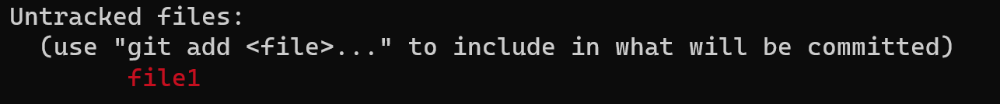

The ``file1`` is now created in our working directory, but it is still untracked i.e. not yet tracked by Git.
To do that we will use the `git add` command and run `git status` to have the status of Git after the modification:

````shell
$ git add file1
$ git status
````
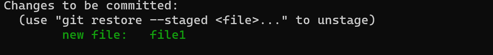
the new file is now tracked by Git, but now, we need to validate this change and save a new version of the project (containing this new file):
So let's commit our first changes.

````shell
$ git commit -m "add a new file"
````

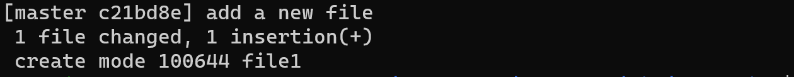

After that, one can use `git push` to update the remote repository.  
The mechanism works as follows:

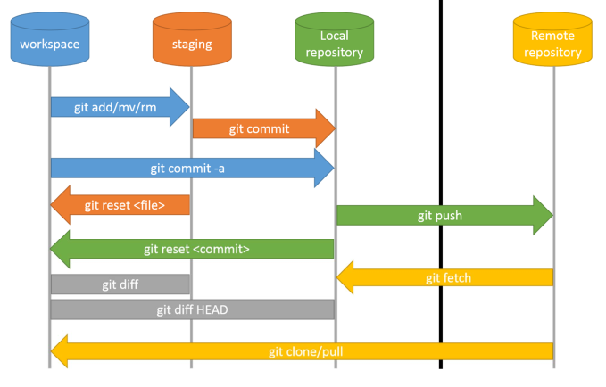


4. **View history**

you can view your commits' history using `git log`:
````shell
$ git log
commit 2658a45cc547f3d29b4683e8cebd0d52f1d929cb (HEAD -> main)
Author: Jon Doe <jon.doe@example.com>
Date:   Sun Apr 16 14:20:30 2023 +0200

    second commit

commit 812db24fe117bc451557936861d74339319106e5
Author: Jon Doe <jon.doe@example.com>
Date:   Sun Apr 16 14:09:20 2023 +0200

    add a new file
````

without any options, this command will output a sequence of individual commits' information. 
that contains the **commit ID (SHA1)**, the commit author, the date of the commit and its message.

Note (HEAD -> main) in the first commit is to say that this is the tip of the branch main.
you can use the option ```--oneline``` or ``--graph``.

To have more details about the commit ID, you can use the ```git show``` that shows objects.
for example:
````shell
$ git show 2658a45cc547f3d29b4683e8cebd0d52f1d929cb
commit 2658a45cc547f3d29b4683e8cebd0d52f1d929cb (HEAD -> main)
Author: Jon Doe <jon.doe@example.com>
Date:   Sun Apr 16 14:20:30 2023 +0200

    second commit
````

to view commit differences. you can use the ``git diff`` command which show changes
between commits, commit and working tree, etc
````shell
$ git diff HEAD^ HEAD
diff --git a/file1 b/file1
index 106287c..42eada1 100644
--- a/file1
+++ b/file1
@@ -1 +1,2 @@
 Hello Git!
+new line
````

- removing and renaming files in your repository:
``git rm`` (to delete staged file) and ``git mv`` to rename staged file.
Note that you need to commit this change but not to add the file.


## 2. Git's basic internals
### 1. Inside the *.git* directory
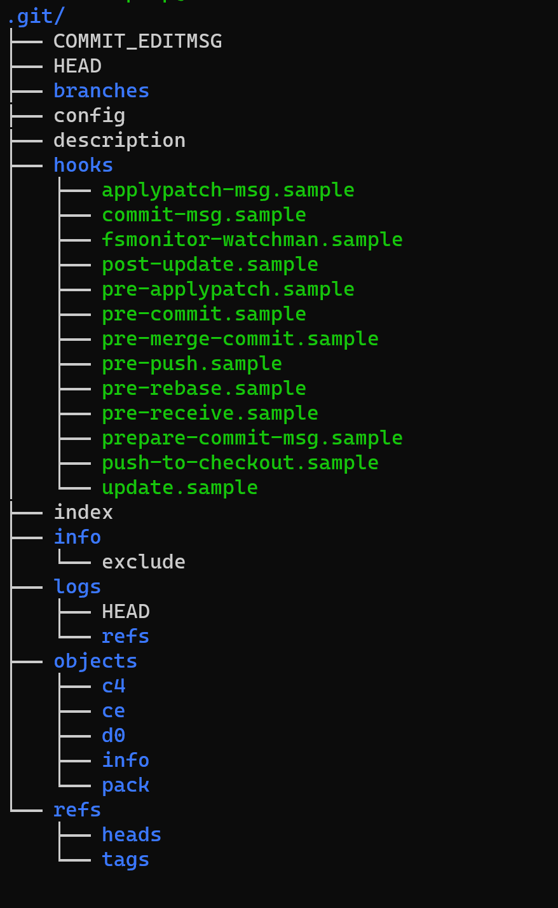

The .git directory contains all the information about the repository, and it directly reflexes the current changes on 
the repository. In summary, it contains the following:

#### subdirectories: 
- hooks: git special scripts
- info: exclude file for ignored patters
- objects: all git objects (stored as hash values)
- logs: commits information
- refs: pointers to commit objects

#### files:
- HEAD: current branch
- config: configuration options
- description
- index: staging area (binary)

### 2. Git object store
- **Blobs (Binary Long Objects)**: refer to any file containing any data.
A blob contains a file's data but does not contain any metadata about it, even its name.
- **trees**: A tree object represents a directory information. It records blob identifiers, pathnames and some metadata 
for all files in the directory.
It can reference another subtree and thus build a complete hierarchy of files and subdirectories.
In simple terms, a tree records the contents of a single level in the directory hierarchy.
It lists files and subtrees by including their name and an identifier for the Git object they represent.
- **Commits**: A commit object holds metadata for each change introduced into the repository,
including the author, committer, commit date, and log message.
Each commit points to a tree object that captures, in one complete snapshot, the state of the repository at the time of the commit.
- **Tags**: a tag object assigns a human-readable name to a specific object, usually a commit.

#### Index
the index stores binary data and is private to your repository.
the content of the index is temporary and describes the structure of the entire repository
at a specific moment in time. It represents a cached representation of the all
the blob objects that reflects the current state of the project.
The index keeps records of staged changes (after git add)


#### SHA1
Each Git object is associated with a unique name produced by applying
SHA1 to the content of the object, yielding a SHA1 hash value.
Sha1 values are 160-bit values that are represented as a 40-digit hexadecimal number such as 
`2658a45cc547f3d29b4683e8cebd0d52f1d929cb`.
(Note: Sha1 always computes the same ID/hash for identical content)

## 4. Intermediate steps
### 1. Branches
A branch allows the user to launch a separate line of development within the project.
This allows development to progress in multiple directions simultaneously.
Each commit you create will be applied to only one of the branches, the one which is marked active.

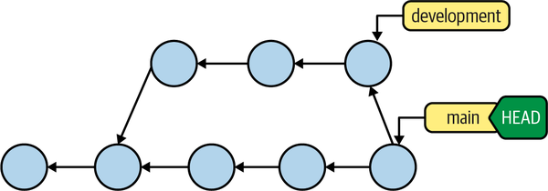


The branch name will always refer to the most recent commit on the branch, which is called the *HEAD*.
A branch name a simple pointer to a specific commit.

when you create a new branch, it is always based upon an existing commit within the repository.
it can be the HEAD commit or a different commit that you reference explicitly using its hash value.

The basic form of the command is as follows:
````shell
$ git branch branchname start-commit
````
if you don't specify a ``start-commit``, the default point will be the HEAD on the currently active branch.

You need then to switch to the new branch in order to make changes in it.
you can list branches using ``git branch``

#### DETACHED HEAD
you can checkout to any commit in the log history. you will be in a state known as detached head mode.
because the branch and the head point to different commits.
you are free to add new commits as experimental changes in your development project.

those commits are also known as unreachable commits. In other words, there is no permanent
reference to the commits other than the head. when you switch to another named branch, the commits will disappear.
if you decide to keep those commits, you must first create a new branch.

deleting branch
````shell
$ git branch -d branchname
````
a warning message stating that branchname is not fully merged means that there are changes that are not included in the main branch.
you are loosing some developments. Git is keeping you from accidentally losing content from the branch to be deleted.
to force you can use -D option.

in case the content of the wanted to be deleted branch is present in another branch, you can check that out and then procede to the deletion safely.

### 2. Commits
Every commit represents a single atomic changeset with respect to the previous state. A commit snapshot represents
the state of the total set of modified files and directories. 
Commits are references explicitly by their hash values (40 hexadecimal digits) or implicitly via refs/ symrefs / relative 
commit names (HEAD, HEAD~2, ..).

``git log`` output will include every associated commit and its log messages reachable from the specified starting point (by default HEAD)

it is possible also to give a range, for example ``git log HEAD~3 HEAD~5``

### 3. Merging branches

Merging is combining two or more different lines of development.
It unifies two or more commit histories of branches. All the branches to be merged must be in the same repository.
when modifications in one branch do not conflict with modifications found in another branch, Git computes a merge result
and creates a new commit that represents the new, unified state.

Your current branch is always the target branch, and changes from other branches are merged into the current branch.
As an example, the following commands are used to switch to the *main-branch* to set it as the current branch, then merge
the *modified-branch* into it:
````shell
$ git checkout main-branch
$ git merge modified-branch
````

#### Merge with a conflict
Conflicts are created when two lines of development have different versions of the same file(s). Git cannot automatically
determine what is correct (which version to keep). In this case, Git will mark the conflicts to be resolved and it's on 
the developer making the merge to manually fix and choose which version to keep.

Let's simulate a merge conflict: 2 branches containing the same file but with a different line. In master branch:
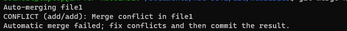    
Git warns you of the conflict in *file1*. In addition, you can locate all the conflicted files using the ``git status``
command:

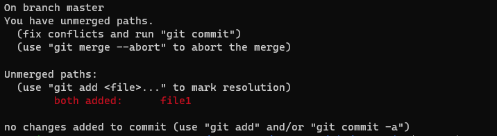             

To inspect the conflicts in the file, you can just view the content of the file: ```cat file1```:

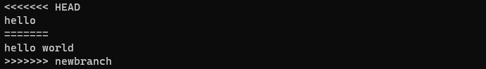    

The marker lines are automatically generated by Git to indicate the difference between the versions of the file.
Once the modifications are done, you can run  ``git add`` then ``git commit`` to continue the merge.
 


#### viewing branches and their commits
the ``git show-branch`` provides more details than ``git branch``
its output is divided into two parts, separated by a line of dashes.

the section above the separator lists the following:
- the name of branches in square brackets, one per line
- each branch name prefixed with special characters: (*) to denote the current branch and (!) for other branches.
- each branch name with its commit message from the most recent commit

the section below the separator lists each commit together with its branch name:
- stating which commits are present in each listed branch
- prefixed with special characters: (+) the commit is present in the listed branch, (*) indicates that the commit is present in the
current branch, and (-) denotes that the commit is a merge commit on the branch

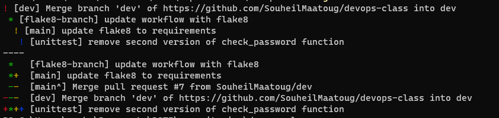    


### 4. Altering commits
There are several schools of thought. One philosophy might be termed *realistic history*: every commit is retained and nothing is altered.

on variant of this known as a *fine-grained* realistic history, where you commit every change as soon as possible.
another option is *didactic* realistic history, where you take your time and commit only your best work at convenient and suitable moments.

Given the opportunity to adjust the history -- possible cleaning up a bad intermediate design decision or
rearranging commits into more logical flow -- you can create a more 'idealistic' history.

### git revert
```git revert commit``` applies the inverse of the given commit. generally this command is used to introduce a new commit thet
reverses the effects of a given commit.
The revert doesn't alter the existing history within a repository. Instead, it adds a new commit to the history.
It is considered as a safe command (ultimately for shared repositories)

### git commit --amend
Changes the HEAD commit: The commit has the same content but some aspects requires adjustment or tidying.
A frequent use of git commit --amend is to fix typos right after a commit. however this is not the only use.
It can amend any file or files and can add or delete a file as part of the commit.

### git reset
The ``git reset`` changes your repository and working directory to a known state.
The git reset adjusts the HEAD ref to a given commit and, by default, updates the index to match that commit.
git reset can also modify your working directory to mirror the revision by a given commit.
git reset is considered as a destructive command because it can overwrite and destroy changes.

the git reset has three main options ``--soft``, ``--mixed`` and ``--hard``.

- ``git reset --soft commit``:
The soft option changes the head ref to point to a given commit. The contents of your index and working directory are left unchanged.
It will move the commits above in the staging area.
example: suppose you make a commit, then you add a file and realize that you need to combine this staged change with the previous commit.
go back and do it correctly:
commited files are moved to staged are. you can then combine the files in one commit or commit them in another order.
``git reset --soft HEAD^`` return to the previous commit.


- ``git reset --mixed commit``:
it changes the head to point to the given commit. your content are also modified to align the tree structure.
It will move the commits above in the working directory.
``git reset --mixed HEAD^`` return to the previous commit.

commited files return to working directory. In that case you can add one by one or choose in which order to add and commit them.

- ``git reset --hard commit``:
it changes the head ref to point to the given commit. The content of the index are also modified to agree with the tree structure.
your working directory contents are changed to reflect the state of the tree represented by the given commit.
modifications are then lost and new files added but not tracked will stay untouched.
hard reset comes back to the chosen commit and deletes commits above.


### git rebase
It is used to alter where a sequence of commits is based.
this command requires at least the name of the other branch onto which your commits will be relocated. By default, the commits
from the current branch that are not already on the branch are rebased.

A common use for git rebase is to keep a series of commits that you are developing up to date with respect to another branch.

for example: A *topic* branch started on the *main* branch when it was at commit B. In the meantime, it has progressed 
to commit E.

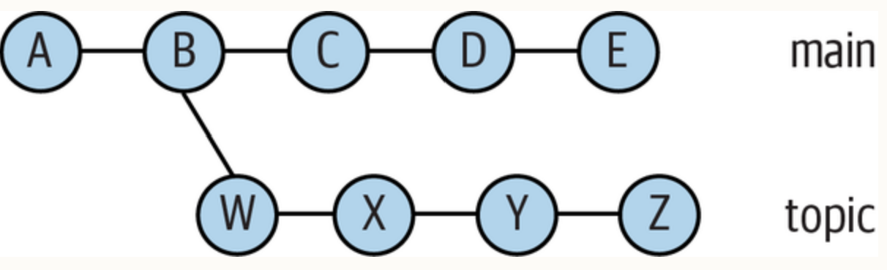    

````shell
$ git checkout topic
$ git rebase main
````

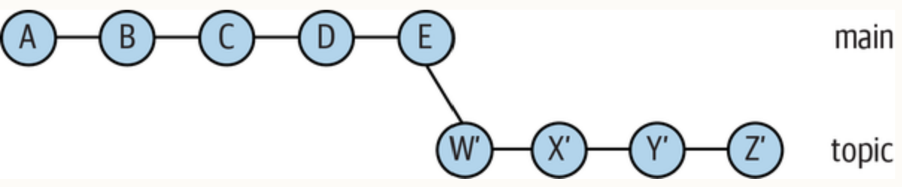    


### git rebase -i
for reordering, editing, removing, squashing multiple commits into one, and splitting one commit into several commits.

The command ``git rebase -i main~3`` opens an interative text editor to edit the last 3 commits:

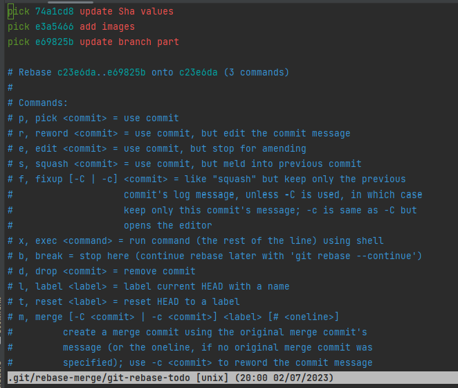    

TODO: stash - reflog - git diff

## 5. Team work (in progress..)
1. workflows branches
2. methods / concepts
3. pull requests
4. CI/CD
5. hooks
6. commit messages and branch names

## 6. References
- Version Control with Git, 3rd edition (Prem Kumar Ponthorai, Jon Loeliger)
- [Official Git Manual](https://git-scm.com/docs/user-manual.html)
